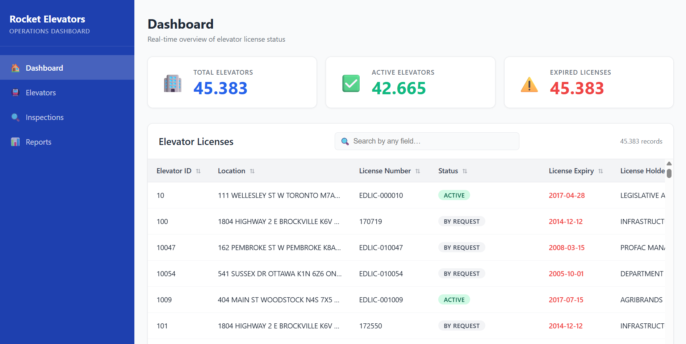

# Rocket Elevators — Operations Dashboard

Dashboard interactivo para la gestión y monitoreo de ascensores. Proporciona visualización en tiempo real del estado de licencias, ubicaciones operativas e información de inspecciones.

## Características

- **Resumen Operativo**: Métricas clave de ascensores activos, vencidos y en espera
- **Mapa Interactivo**: Localización de dispositivos por zona geográfica
- **Análisis de Licencias**: Estado y fecha de vencimiento de certificaciones
- **Panel de Inspecciones**: Historial y próximas inspecciones programadas

## 📊 Dashboard Preview



## 📁 Estructura del Proyecto

```
rocket-elevators/
├── apps/dashboard/          # Aplicación web del dashboard
│   ├── index.html
│   ├── script.js
│   └── styles.css
├── data/                    # Datos del proyecto
│   ├── elevator_licenses.csv
│   └── summary_stats.json
├── notebooks/               # Análisis exploratorio de datos
│   └── data_analysis.ipynb
└── docs/                    # Documentación técnica
```

## ⚡ Inicio Rápido

1. Abre `apps/dashboard/index.html` en tu navegador
2. Los datos se cargan automáticamente desde `data/elevator_licenses.csv`

## 📋 Requisitos

- Navegador web moderno (Chrome, Firefox, Edge, Safari)
- Datos en formato CSV con estructura definida

## 📝 Licencia

Rocket Elevators © 2026
